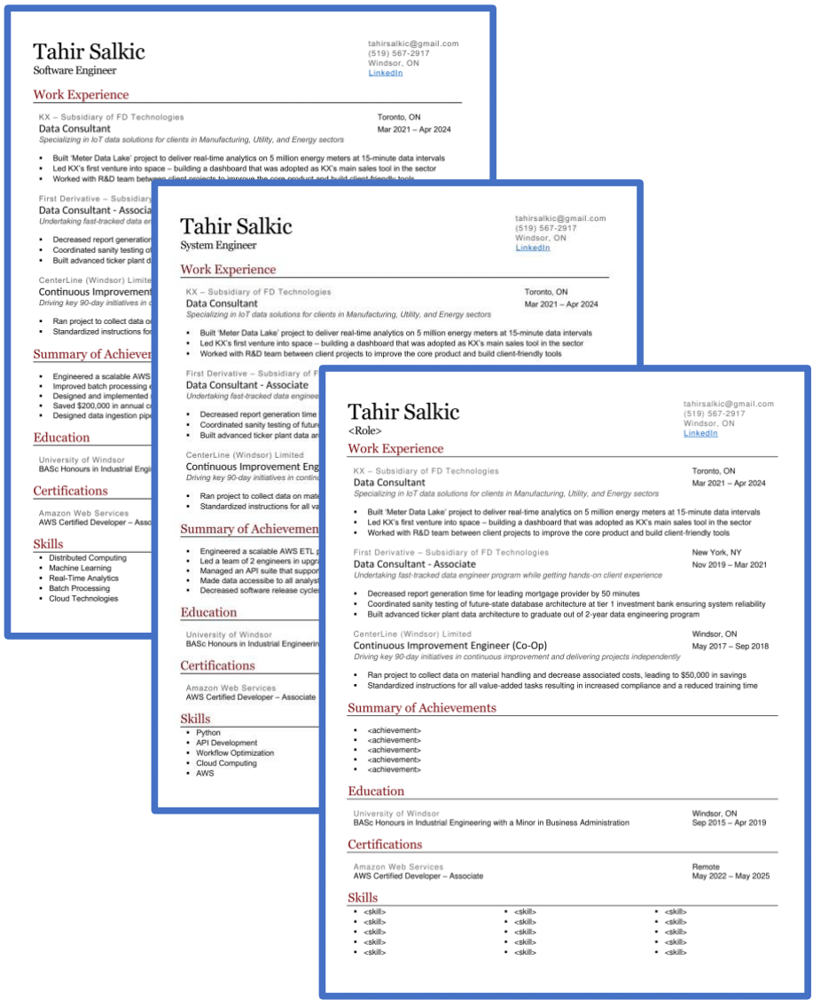

<!--
*** Thanks for checking out the Best-README-Template. If you have a suggestion
*** that would make this better, please fork the repo and create a pull request
*** or simply open an issue with the tag "enhancement".
*** Don't forget to give the project a star!
*** Thanks again! Now go create something AMAZING! :D
-->

<!-- PROJECT SHIELDS -->
<!--
*** I'm using markdown "reference style" links for readability.
*** Reference links are enclosed in brackets [ ] instead of parentheses ( ).
*** See the bottom of this document for the declaration of the reference variables
*** for contributors-url, forks-url, etc. This is an optional, concise syntax you may use.
*** https://www.markdownguide.org/basic-syntax/#reference-style-links
-->

  
  
  
  
  
  
   
  
  

<!-- PROJECT LOGO -->

  
  <h1 align="center">Resume Compiler: Making Every Application Count</h1>

Welcome to Resume Compiler, a tool designed to enhance your applications and streamline the process of tailoring your resume.

Resume Compiler helps you analyze key skills in job postings, build a bank of career achievements, and automate the tailoring process for your resume, allowing you to apply more and write less.

## ⚡ Getting Started

## 🚀 Documentation

## 🤝 How to Contribute

Resume Compiler is a community-driven project, and contributions are welcome from everyone.
Whether you're a developer, a researcher, or simply enthusiastic about improving people's job search experience, there are many ways to get involved:

- **Code Contributions:**
- **Research and Evaluation:**
- **Feedback and Testing:**

For details, please check [CONTRIBUTING.md](./CONTRIBUTING.md).

## 🤖 Join Our Community

- [Discord server](https://discord.gg/FVjYtyMG) - This is a community-run server for general discussion, questions, and feedback.

## 📜 License

Distributed under the MIT License. See [`LICENSE`](./LICENSE) for more information.

## 🫡 Acknowledgements
